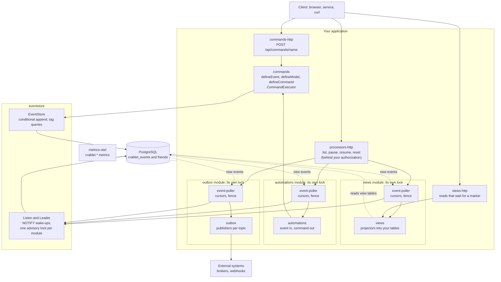
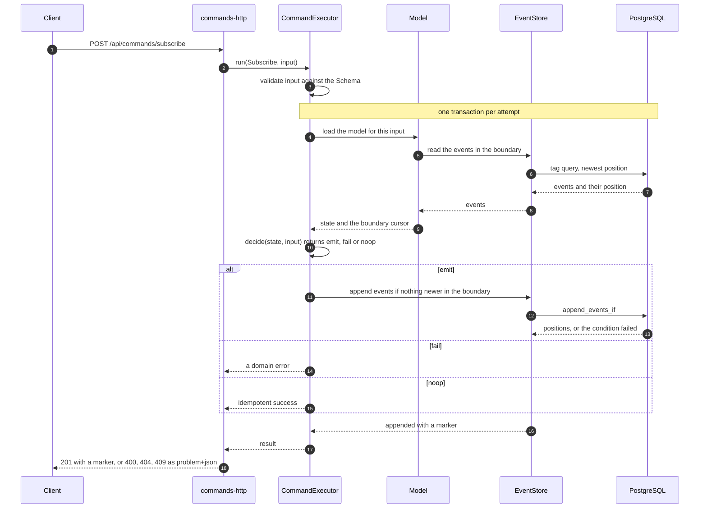
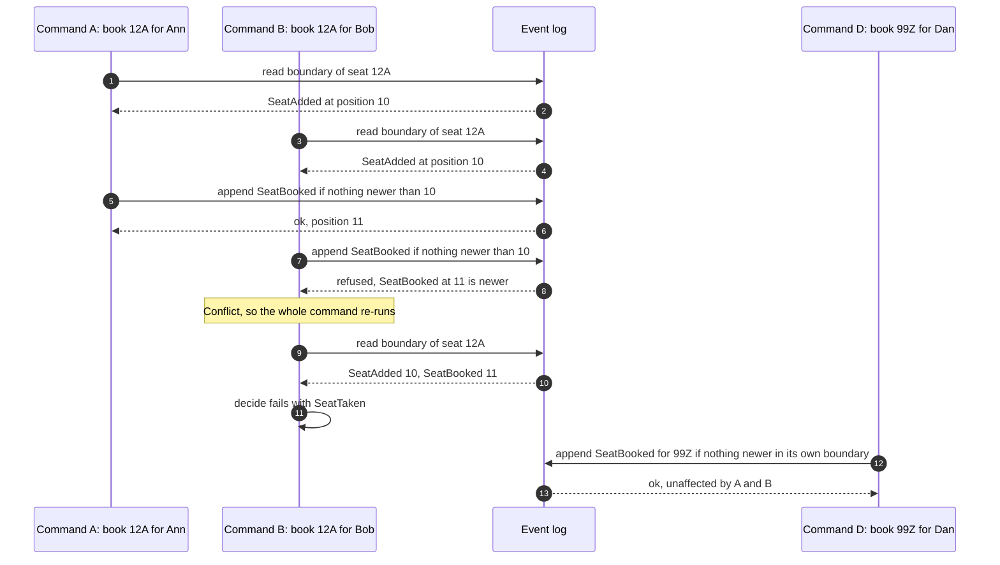
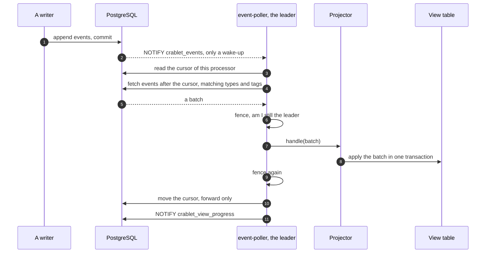
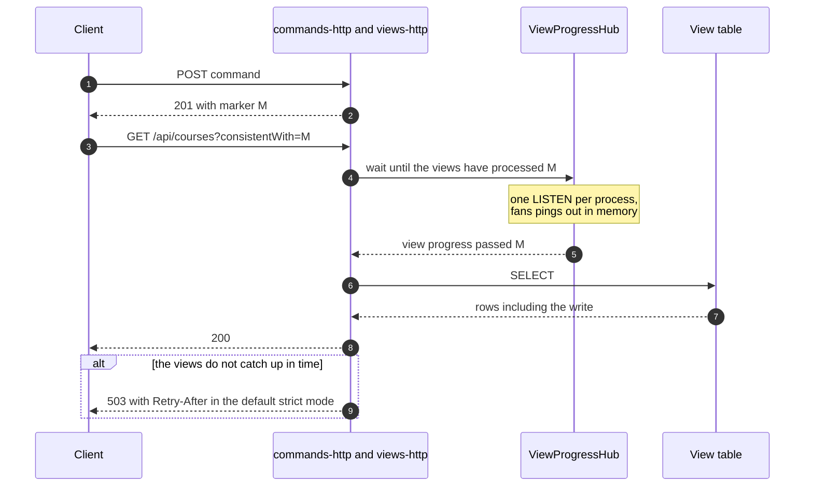
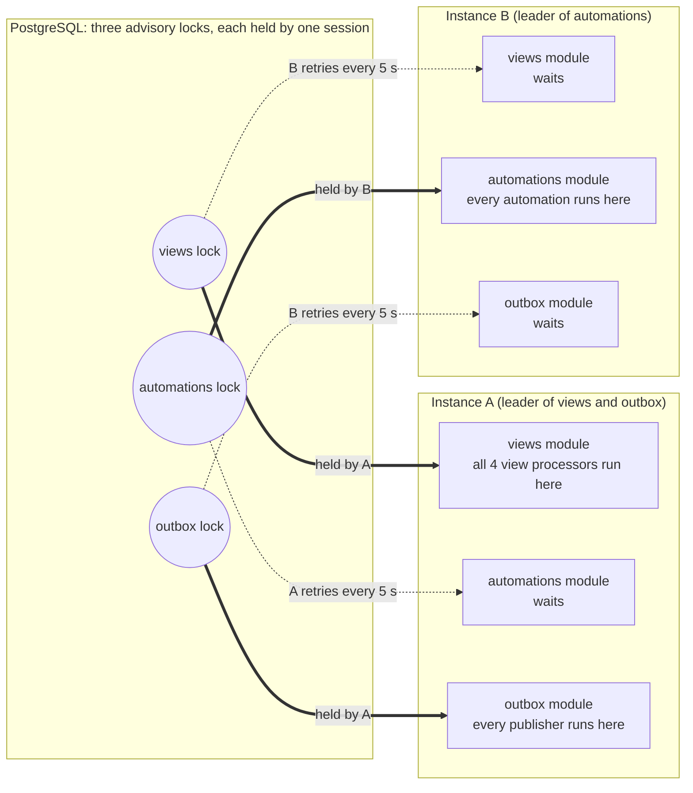
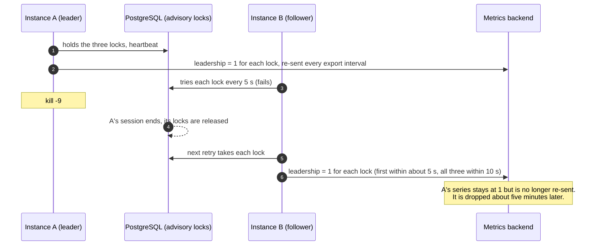
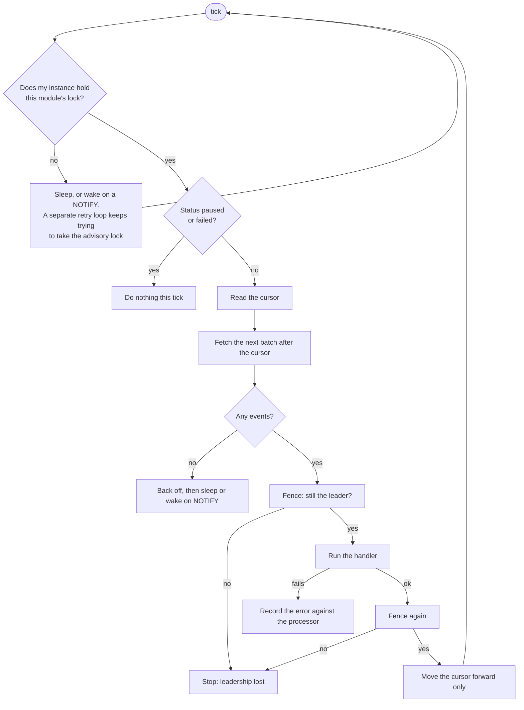
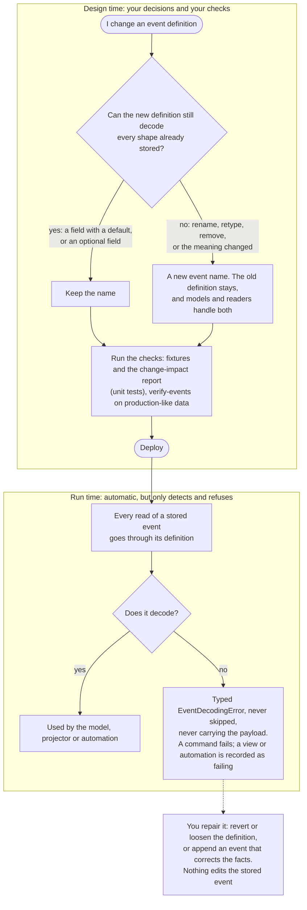
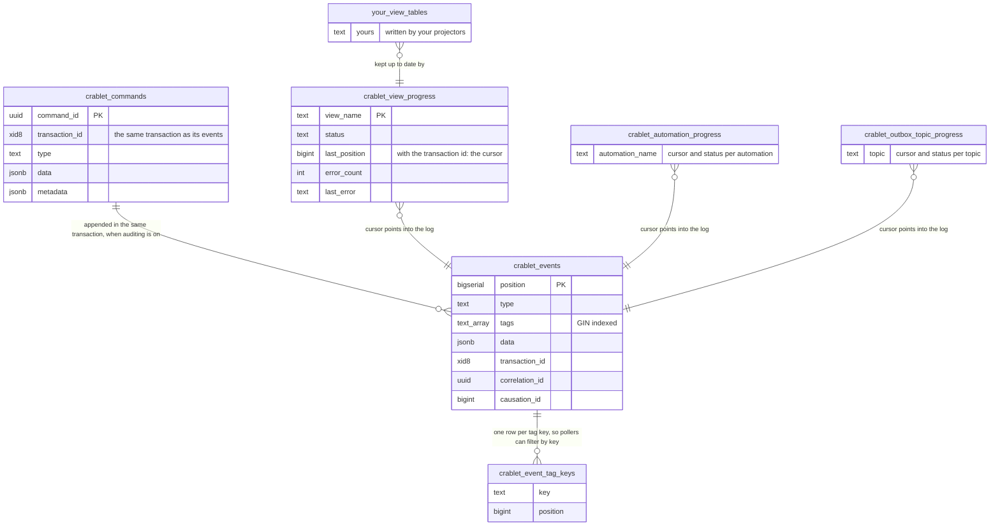

# Architecture

How the pieces fit, and how the core features work, in diagrams. Every diagram is a map of code that exists: the names are real packages, modules and tables. For the reasons behind
each design, follow the links to the [decision records](./adr/README.md); for the words, see the [glossary](./glossary.md).

The two example applications also have [C4 models](./c4-examples.md) (context, containers, components).

Contents: [the whole system](#the-whole-system) · [a command, from request to append](#a-command-from-request-to-append) · [two commands that conflict](#two-commands-that-conflict) ·
[from event to view](#from-event-to-view) · [a read that includes your write](#a-read-that-includes-your-write) · [one lock per module, one leader per lock](#one-lock-per-module-one-leader-per-lock) ·
[changing an event](#changing-an-event) · [what is in the database](#what-is-in-the-database)

## The whole system

One PostgreSQL database holds one event log. Everything that writes goes through `eventstore`'s conditional append; everything that reacts reads the same log through a poller.

Reading it: a **write** goes client → `commands-http` → `commands` → `eventstore` → Postgres. A **reaction** starts at a module's poller (the views, the automations and the outbox each have their own, and their own leader lock), which reads new events and hands them to that module's processors; an automation turns an event back into a command. A **read** of a view goes through `views-http`, which can wait until the view has caught up. An operator can list the processors and pause, resume or reset one through `processors-http`. Each package
is described in [the reference](./reference.md#packages).

## A command, from request to append

The executor is the only place a decision becomes an append. `decide` is pure; everything that touches the database is around it, inside one transaction.

The idempotency check runs inside the append before the concurrency check, so a repeat of an already-done operation is an idempotent success, never a spurious conflict. The
command is audited when auditing is on. See [ADR-0003](./adr/0003-non-commutative-append-concurrency-protection.md) and [ADR-0010](./adr/0010-declarative-command-api.md).

## Two commands that conflict

This is the idea of dynamic consistency boundaries. Two bookings of the same seat share a boundary, so one of them must lose; a booking of a different seat shares nothing with
either and never waits.

The retry is safe because `decide` is pure and the first attempt's transaction rolled back. `retries` defaults to 3; when they run out, the last `Conflict` is reported.
Commands that are safe to run in parallel with themselves (deposits) declare `concurrent({ guard })` and only the guard events can conflict. A model over several entities (`all(...)`) uses the
union of their boundaries, and its cursor is the earliest of the members' read horizons, which never misses a conflict. Walkthrough: [DCB guide](./dcb-guide.md).

## From event to view

A poller turns the log into a read model. Delivery is at-least-once, so the projector must be idempotent, and the cursor makes sure nothing is skipped.

The wake-up is only a hint: if it is lost, the next poll finds the events anyway (the poll interval is the fallback). The cursor is a `(transaction_id, position)` pair rather than a bare position,
because a transaction with a lower id can commit after one with a higher position; a bare position would skip its events for ever ([ADR-0012](./adr/0012-transaction-position-cursors.md)).
The same loop drives the outbox (`publishBatch`) and automations (`decide`, then run a command).

## A read that includes your write

Views update after the command returned, so a client that writes and then reads could see old data. The command returns a **marker**; the read carries it and waits.

A read with no marker waits for the head of the log. The modes are `strict` (right or a `503`, the default), `bounded` (returns the data marked stale after a timeout) and `eventual` (does not wait).
A client that did not write learns that something changed from a **ping** over server-sent events and reads again. See [ADR-0015](./adr/0015-read-consistency-by-marker.md),
[ADR-0014](./adr/0014-live-updates-by-ping.md) and [ADR-0016](./adr/0016-one-listen-per-process-for-view-progress.md).

## One lock per module, one leader per lock

Every instance of the application starts the same processors. A PostgreSQL advisory lock decides which instance runs them, and **the lock is per module, not per processor**: there is one lock for
the views, one for the automations and one for the outbox publishers (`VIEWS_LOCK_KEY`, `AUTOMATIONS_LOCK_KEY`, `OUTBOX_LOCK_KEY` in `eventstore`'s `Leader.ts`). The instance that holds a
module's lock runs **all** of that module's processors (every view, every automation, every publisher); the others wait and retry. The three locks are independent, so a different instance may lead each
module, though the first instance to start usually leads all three. The diagram shows one possible split, not the usual one.

Two consequences. **A processor's status is per processor** (you pause one view, not the module), but **who runs it is per module**: pausing a view does not move it to another instance, and a
dead instance takes all of its modules' processors with it until another instance takes the locks. And **leadership is observed per module**: the `crablet.poller.leadership` gauge carries the lock's number
(`lock_key`) and the instance, not a processor id.

What happens when the leader dies, observed by killing the process (`kill -9`) in a two-instance run ([the crash test](./plans/dashboard.md)):

The loop below is one processor's tick, inside the module that holds the lock.

The heartbeat checks `pg_locks` for this session rather than just pinging the connection, so a leader whose lock is gone (a dead session) stops instead of handling events the new leader also handles.
The cursor update is guarded in SQL so it cannot move backwards. A graceful stop releases the lock and announces it with a wildcard NOTIFY, so another instance takes over immediately; after a crash, the
others notice on their next retry (5 s by default). See [ADR-0006](./adr/0006-leader-election-via-sql-reserve.md), [ADR-0007](./adr/0007-event-poller-fiber-model.md) and the
[reliability report](./plans/reliability-and-scale-diagnostic.md).

## Changing an event

Events are stored for ever, so a definition change must keep old events readable. **Deciding that is the programmer's job, at design time.** The framework's part at run time is only to detect an
event it cannot read and refuse it; it never converts or repairs one.

Tags are additive-only for the same reason: a model's boundary is found by tags. Who does what, in a table: [Evolving events](./evolving-events.md#who-does-what-you-decide-the-framework-detects);
decision: [ADR-0017](./adr/0017-event-evolution-by-compatibility.md).

## What is in the database

The framework owns these tables (the schema in [`@crablet/db-migrations`](../packages/db-migrations/README.md)); your views live beside them.

The event row carries its tags as an array (for the append condition and tag queries); `crablet_event_tag_keys` holds only the tag **keys**, one row per event and key, so that a poller's "has any of these keys" filter does
not scan the log. There is no foreign key between them (migration V11). The tables are sized and monitored as described in [Monitor it](./guides/monitor-it.md) and
[ADR-0019](./adr/0019-storage-visibility-and-the-tag-table.md).
