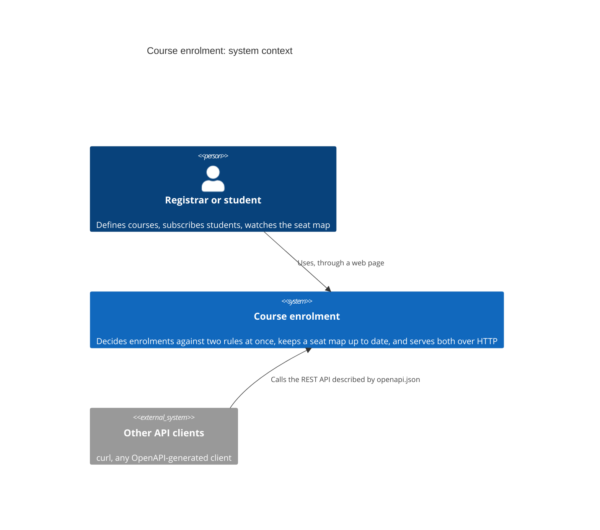
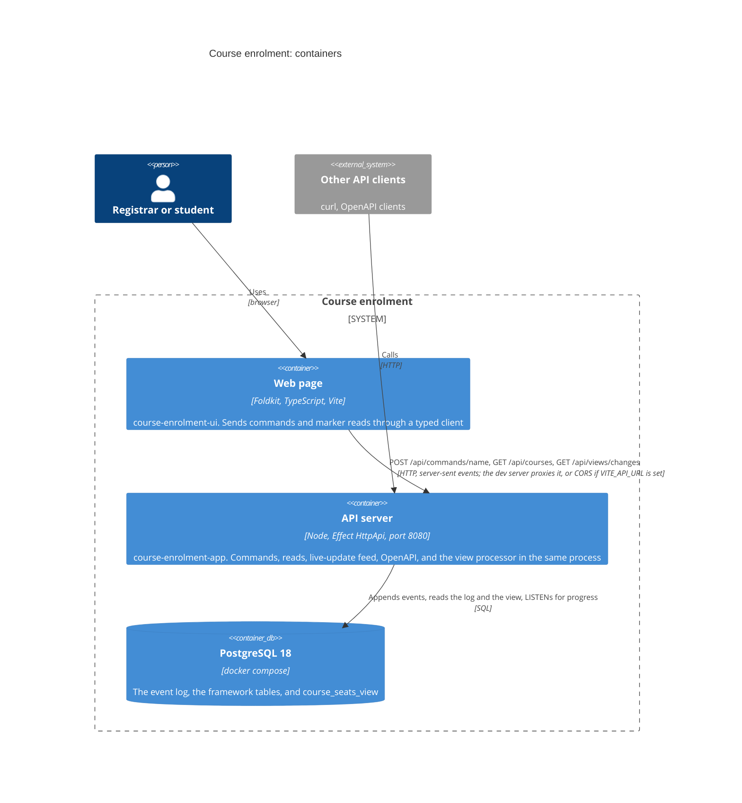
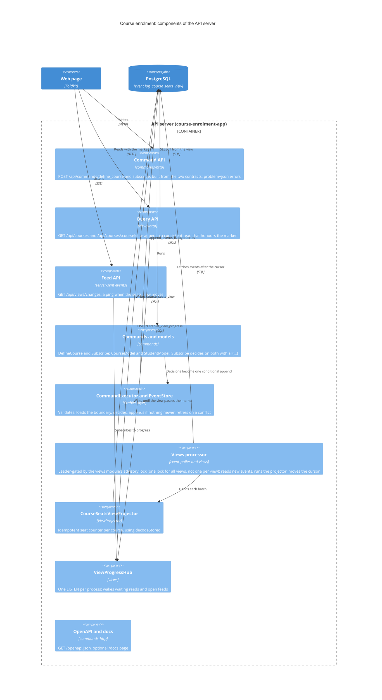
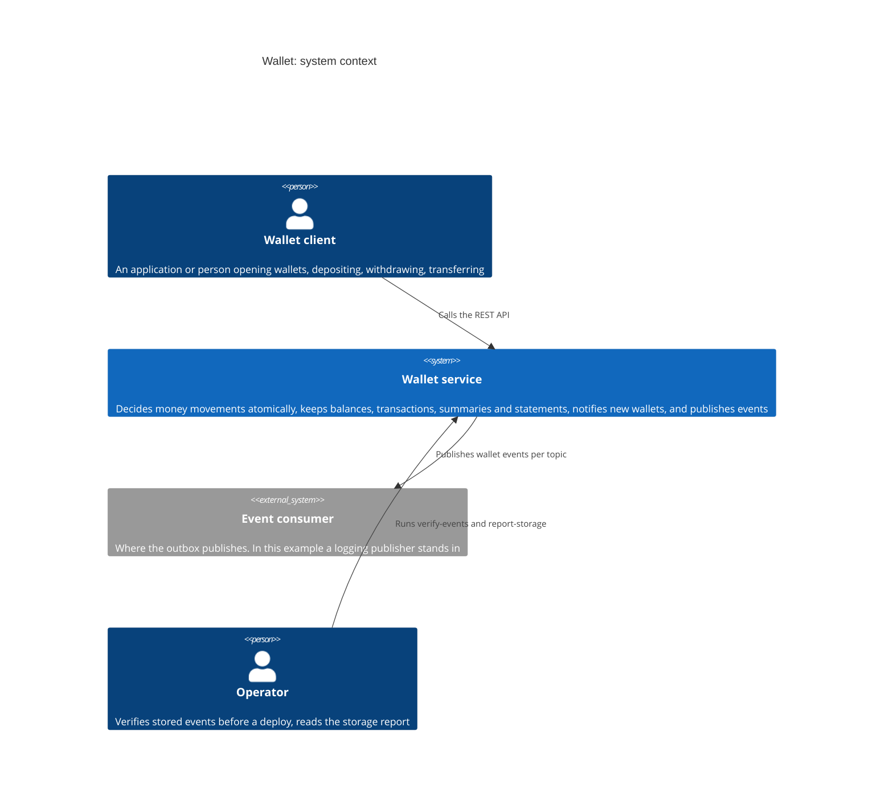
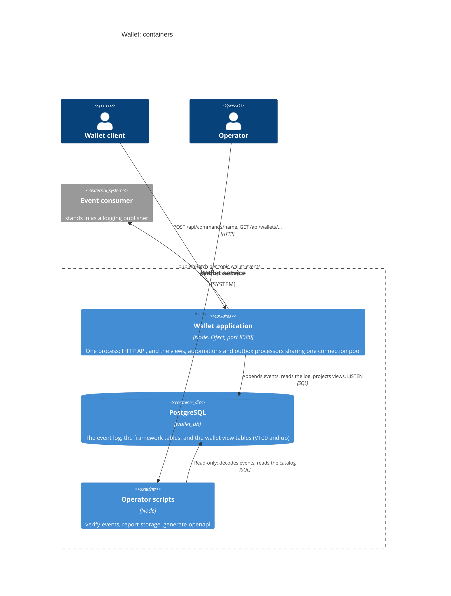
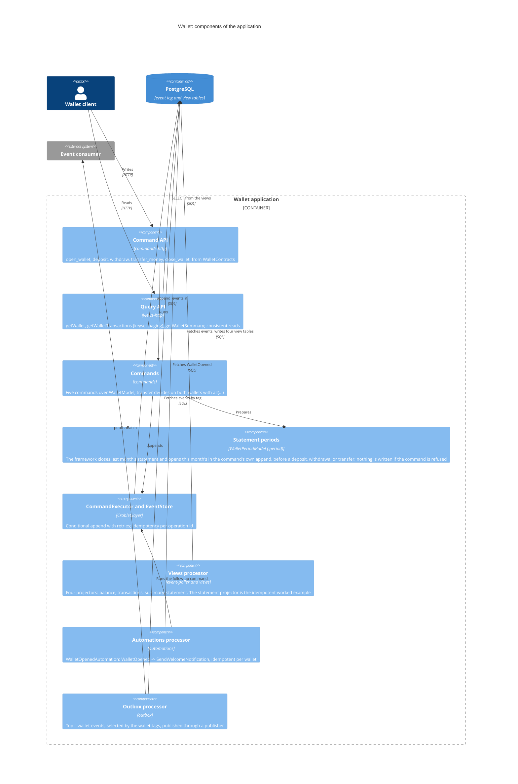
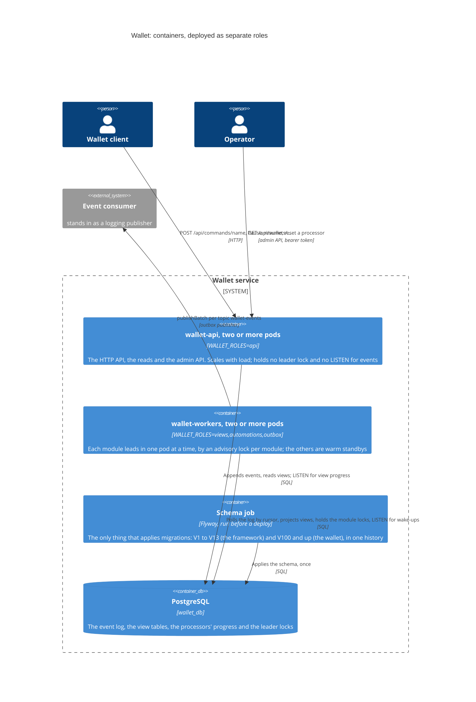
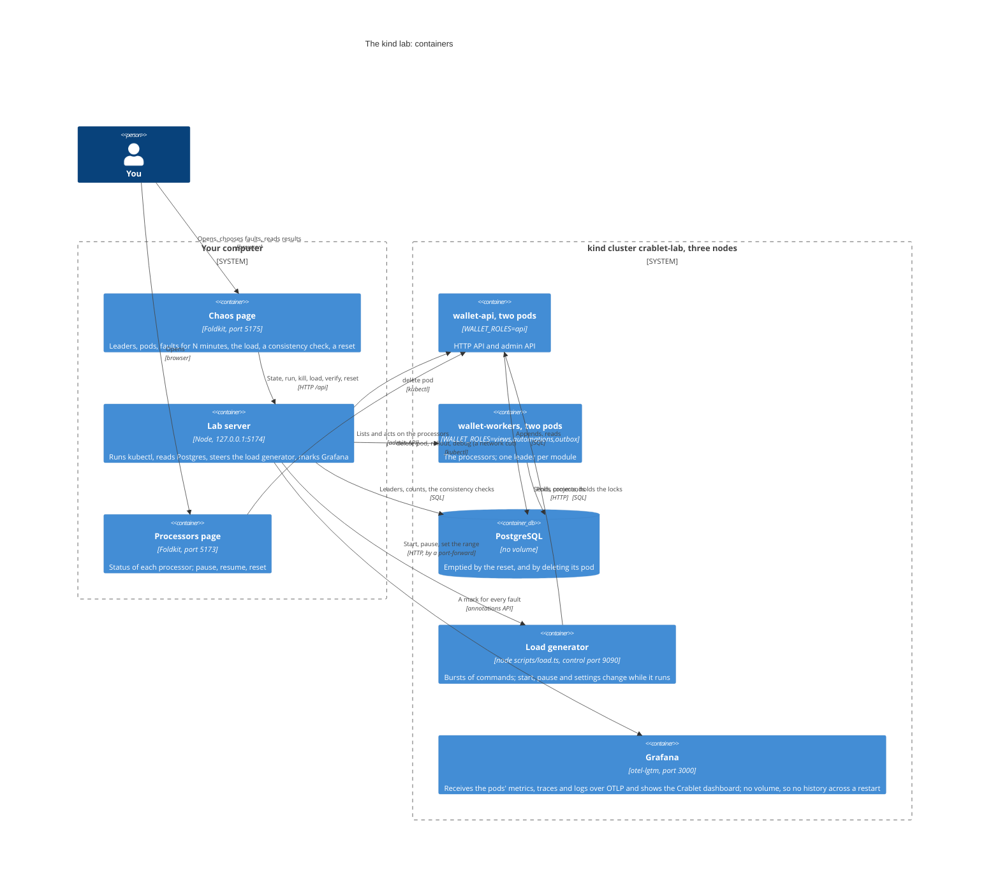

# C4 models of the examples

The [C4 model](https://c4model.com) describes a system at three zoom levels: **context** (the system among its users and neighbours), **containers** (the separately running
parts: applications and databases), and **components** (the parts inside one container). These are the models of the two applications you can run. For the framework's own flows, see
[Architecture](./architecture.md); for the code, the READMEs of [`course-enrolment-app`](../examples/course-enrolment-app/README.md),
[`course-enrolment-ui`](../examples/course-enrolment-ui/README.md) and [`wallet-example-app`](../examples/wallet-example-app/README.md).

Contents: [Course enrolment](#course-enrolment) · [Wallet](#wallet)

The diagrams are Mermaid's C4 syntax (GitHub draws them); the layout is automatic, so read the arrows and labels, not the positions.

## Course enrolment

The [tutorial](./tutorial/README.md)'s service: a course holds at most N students and a student takes at most 3 courses, decided together; one view; a web page.

### Level 1: context

### Level 2: containers

### Level 3: components of the API server

Where to read the code: the contracts and commands in `src/domain/`, the API in `src/CourseApi.ts` and `src/CourseApp.ts`, the reads in `src/api/`, the projector in `src/views/`.
The page's own structure (Model, Messages, `update`, `view`, subscriptions) is in [tutorial step 5](./tutorial/05-a-page-that-uses-it.md).

## Wallet

The framework at full size: five commands, four views, an automation, an outbox and an HTTP API in one process.

### Level 1: context

### Level 2: containers

### Level 3: components of the wallet application

Where to read the code: the domain in `src/domain/` (one file per command), the composition in `src/WalletApp.ts` (`startBackgroundProcessors` starts the three processors),
the views in `src/views/`, the automation in `src/automations/`, the read endpoints in `src/api/`. The statement view is written but this example has no read endpoint for it.

### Level 2 again: deployed as separate roles

The same image, started with different roles ([ADR-0022](./adr/0022-runtime-roles.md)). The diagram above is the default, `WALLET_ROLES=all`, one process.

### The kind lab

What runs where when the wallet is run on a local Kubernetes cluster and broken on purpose ([Run the kind lab](./guides/run-the-kind-lab.md)). The pages and the server behind the chaos page run on your computer, because a browser cannot run `kubectl`.

